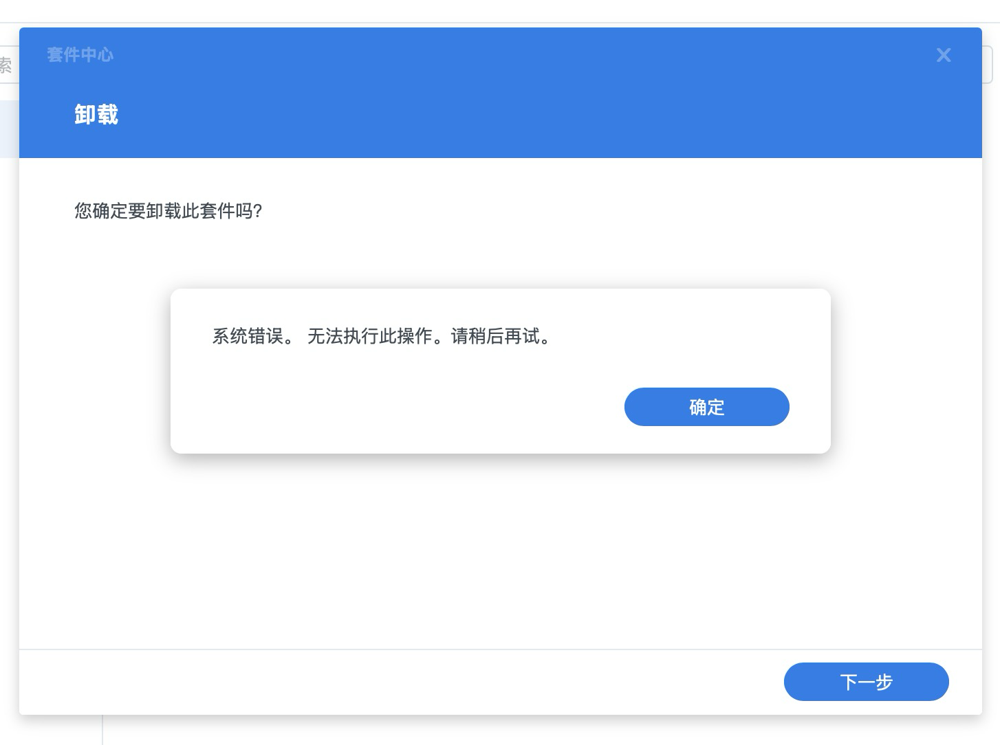

# 为什么无法安装和卸载案例套件



安装的时候提示出错，好不容易安装上了，但是卸载的时候也提示出错（“系统错误，无法卸载此套件”），为什么？


安装的时候，可能是加载套件出了问题，可以稍作等待，然后尝试。但是卸载的问题，目前还没有找到好的解决方案，只能尝试通过重启系统来解决问题。

以下是我在尝试卸载无果后，视图通过命令行卸载，得到的提示：

## 1. 尝试卸载套件
```bash
caoyang@DS923plus:~$ synopkg uninstall ExamplePackage-1.0.0-0001
{"action":"prepare","error":{"code":0},"stage":"prepare","success":true}
```
**解释**：
- 执行卸载命令，系统返回 JSON 格式的响应
- `"action":"prepare"` - 当前处于卸载的准备阶段
- `"error":{"code":0}` - 没有错误（0 表示成功）
- `"stage":"prepare"` - 准备阶段
- `"success":true` - 准备阶段成功

**问题**：这只是准备阶段，后续的实际卸载步骤没有执行或没有输出。

---

## 2. 查看套件列表
```bash
caoyang@DS923plus:~$ synopkg list | grep ExamplePackage
ExamplePackage-1.0.0-0001: this is an example package
```
**解释**：
- `synopkg list` 列出所有已安装套件
- `grep ExamplePackage` 过滤出包含 ExamplePackage 的行
- 输出显示套件**仍然在列表中**，说明卸载没有成功

---

## 3. 多次尝试卸载
```bash
caoyang@DS923plus:~$ synopkg uninstall ExamplePackage-1.0.0-0001
{"action":"prepare","error":{"code":0},"stage":"prepare","success":true}

caoyang@DS923plus:~$ synopkg uninstall --force ExamplePackage-1.0.0-0001
{"action":"prepare","error":{"code":0},"stage":"prepare","success":true}

caoyang@DS923plus:~$ synopkg uninstall ExamplePackage-1.0.0-0001
{"action":"prepare","error":{"code":0},"stage":"prepare","success":true}
```
**解释**：
- 多次执行卸载命令（包括强制卸载），每次都只返回准备阶段成功
- 但实际卸载**从未完成**，所以套件一直存在

---

## 6. 再次确认套件存在
```bash
caoyang@DS923plus:~$ synopkg list | grep ExamplePackage
ExamplePackage-1.0.0-0001: this is an example package
```
**解释**：
- 套件仍然在列表中，确认卸载失败

---

## 7. 检查套件状态
```bash
caoyang@DS923plus:~$ synopkg status ExamplePackage-1.0.0-0001
{"aspect":{"active":{"status":"stop","status_code":263,"status_description":"failed to get unit status"},"error":{"status":"non_installed","status_code":255,"status_description":"failed to locate given package"}},"description":"Status: [255], No such package","package":"ExamplePackage-1.0.0-0001","status":"non_installed"}
```

**解释**：这是一个**关键输出**，显示状态严重不一致：

| 字段 | 值 | 含义 |
|------|-----|------|
| `active.status` | `"stop"` | 套件处于停止状态 |
| `active.status_code` | `263` | 无法获取单元状态 |
| `error.status` | `"non_installed"` | 系统认为套件未安装 |
| `error.status_code` | `255` | 找不到指定的包 |
| `status` | `"non_installed"` | 总体状态：未安装 |
| `description` | `"No such package"` | 描述：没有这个套件 |

**结论**：套件的**数据库状态已经损坏**——列表显示存在，但系统实际找不到它。

---

## 8. 检查套件是否运行
```bash
caoyang@DS923plus:~$ synopkg is_onoff ExamplePackage-1.0.0-0001
package ExamplePackage-1.0.0-0001 isn't turned on, status: [255]
```
**解释**：
- 检查套件是否已启动并运行
- 返回状态码 255，表示套件不存在或未安装
- 与上面的结论一致

---

## 9. 尝试停止套件
```bash
caoyang@DS923plus:~$ synopkg stop ExamplePackage-1.0.0-0001
{"action":"prepare","error":{"code":275,"description":"failed to lock packages"},"stage":"prepare","success":false}
```
**解释**：
- 尝试停止套件
- `error.code: 275` - 无法锁定包
- `"failed to lock packages"` - 包管理器无法锁定套件，通常因为状态异常或文件被占用

---

## 10. 再次尝试卸载
```bash
caoyang@DS923plus:~$ synopkg uninstall ExamplePackage-1.0.0-0001
{"action":"prepare","error":{"code":0},"stage":"prepare","success":true}
```
**解释**：
- 仍然是相同的输出，只有准备阶段成功


## 11. 使用 sudo 查看日志（无输出）
```bash
caoyang@DS923plus:~$ sudo cat /var/log/messages | grep ExamplePackage
Password: 
caoyang@DS923plus:~$ 
```
**解释**：
- 输入密码后执行，但没有输出
- 说明系统日志中没有关于 ExamplePackage 的记录（可能是日志已轮转，或套件从未写入日志）

---

## 12. 检查套件目录是否存在
```bash
caoyang@DS923plus:~$ sudo ls -la /var/packages/ | grep ExamplePackage
drwxr-xr-x  5 root root 4096 Mar 22 17:35 ExamplePackage
```
**解释**：
- `ls -la /var/packages/` 列出所有套件目录
- 输出显示 `ExamplePackage` 目录**存在**
- 权限：`drwxr-xr-x` - root 拥有，其他人可读可执行
- 创建时间：3月22日 17:35

**问题**：套件目录存在，但系统无法识别它为已安装状态。

---

## 13. 检查配置文件目录
```bash
caoyang@DS923plus:~$ ls /usr/syno/etc/packages/ExamplePackage*
caoyang@DS923plus:~$ 
```
**解释**：
- 查看套件配置文件目录
- 没有输出，说明 `/usr/syno/etc/packages/` 下没有 ExamplePackage 的配置文件
- 这进一步说明套件安装不完整

---

## 总结：当前状态

| 检查项 | 结果 |
|--------|------|
| 套件列表显示 | ✅ 存在 |
| 套件目录 `/var/packages/ExamplePackage` | ✅ 存在 |
| 配置文件目录 | ❌ 不存在 |
| 系统状态识别 | ❌ `non_installed` |
| 卸载命令 | ❌ 无法完成 |
| 停止命令 | ❌ 无法锁定包 |

**根本原因**：套件的**元数据不一致**——目录存在但数据库记录丢失或损坏。

---

## 如何解决？

由于系统状态异常，无法通过正常途径卸载。可以尝试以下步骤：

1. 删除套件目录
2. 清理可能的残留
3. 重启系统
4. 验证是否清理干净

```bash
# 1. 删除套件目录
sudo rm -rf /var/packages/ExamplePackage

# 2. 清理可能的残留
sudo find / -name "*ExamplePackage*" -type d 2>/dev/null | grep -v /proc

# 4. 验证是否清理干净
synopkg list | grep ExamplePackage
```

请执行并告诉我结果。