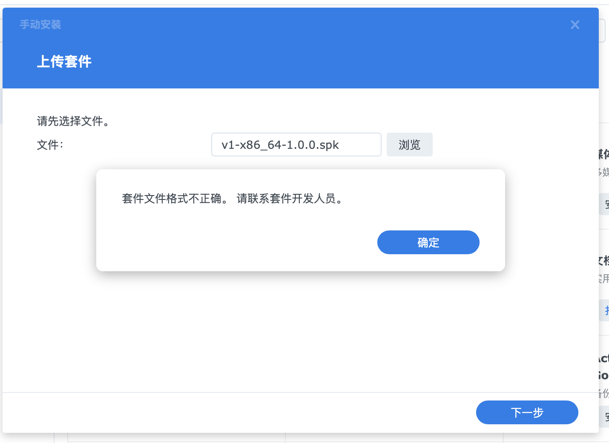

# 解决权限问题


需要创建一个 `privilege` 文件，这是 json 格式的文件，没有后缀名。

## 项目结构

```bash
v1
├── conf
│   └── privilege # 这个文件
├── demo.c
├── INFO.sh
├── Makefile
└── SynoBuildConf
    ├── build
    └── install
```

文件内容如下：

```json
{
    "defaults": {
        "run-as": "package"
    }
}
```

1. run-as：指定进程运行时所使用的用户账户
2. 设置为 "package" 表示使用套件专属用户运行，而非 root 用户

[SPK包中的权限设置介绍](spk_introduction/folder_conf?id=Privilege（权限）)

# 现在，您会遇到新的问题：



