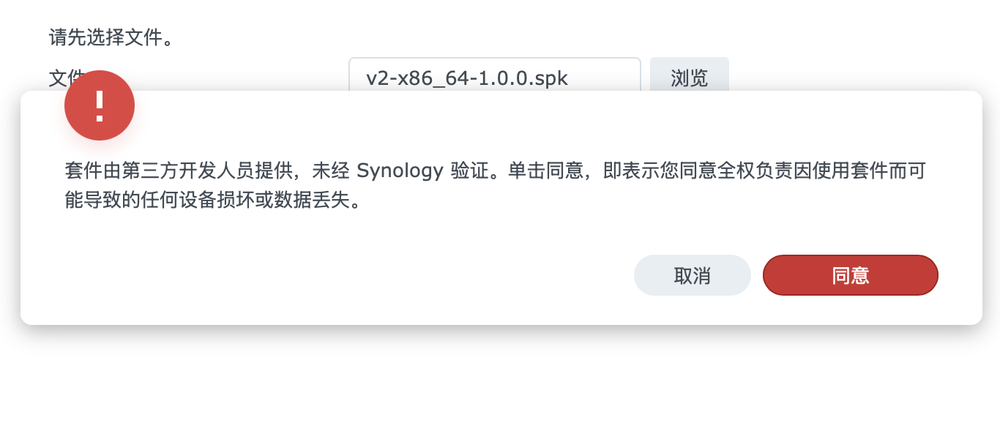
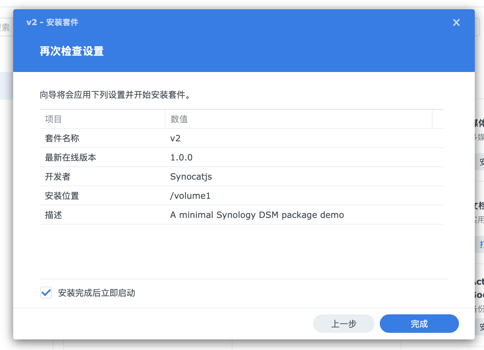
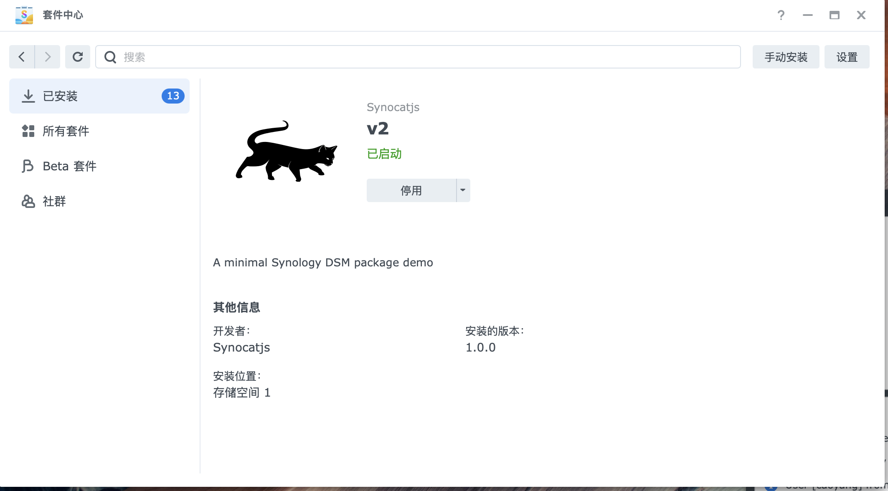

# 解决格式问题

首先创建图片： ` PACKAGE_ICON.PNG` 和 `PACKAGE_ICON_256.PNG`

然后，我们在 `/scripts/` 目录下创建如下文件：

```bash
scripts
├── postinst
├── postuninst
├── postupgrade
├── preinst
├── preuninst
├── preupgrade
└── start-stop-status
```

脚本实现中，我们先什么都不做

其中，`start-stop-status` 如下：

```bash
#!/bin/sh

case "$1" in
    start)
        ;;
    stop)
        ;;
    status)
        ;;
esac

exit 0
```

其余脚本如下：

```bash
#!/bin/sh

exit 0
```

最终目录结构如下：

```bash
v2
├── conf
│   └── privilege
├── demo.c
├── INFO.sh
├── Makefile
├── PACKAGE_ICON_256.PNG
├── PACKAGE_ICON.PNG
├── scripts
│   ├── postinst
│   ├── postuninst
│   ├── postupgrade
│   ├── preinst
│   ├── preuninst
│   ├── preupgrade
│   └── start-stop-status
└── SynoBuildConf
    ├── build
    └── install
```

安装会出现警告：



同意即可。然后提示检查，和正常的安装一样，提示安装成功。




安装成功



这个套件可以正常停用和卸载。

至此，一个基本的套件就创建成功了。

接下来，我们学习如何创建桌面程序。例如一个简单的文本编辑器，解决在编辑非常见格式的情况下，群晖自带的文本编辑器无法打开的情况。
