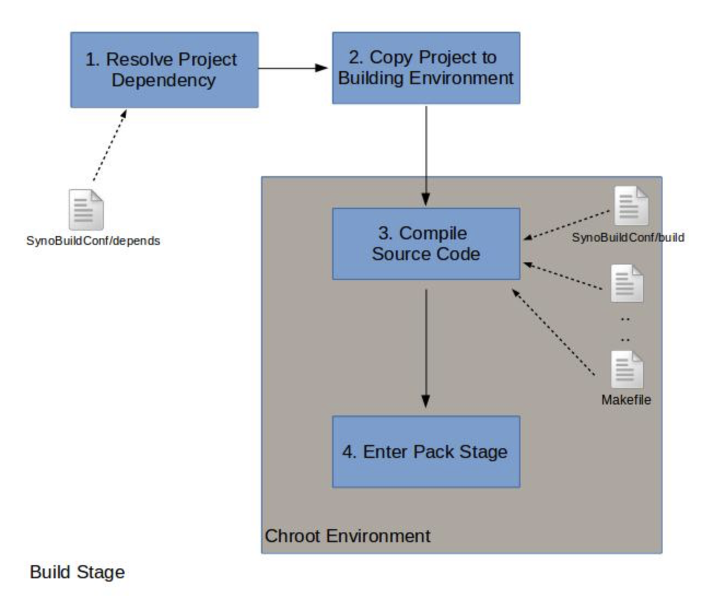

# 构建阶段

在构建阶段，`PkgCreate.py` 将编译项目及其依赖项目。请注意，在此阶段，`PkgCreate.py` 依赖两个构建脚本（`SynoBuildConf/build` 和 `SynoBuildConf/depends`）来获取必要信息。

```bash
PkgCreate.py -v ${version} -p ${platform} ${project}  # 在特定平台版本上构建项目
```

---

## Toolkit 目录结构

```
/toolkit/
├── build_env/
│   └── ds.${platform}-${version}/
├── pkgscripts-ng/
│   ├── EnvDeploy
│   └── PkgCreate.py
└── source/
    └── ${project}/
        └── SynoBuildConf/
            ├── depends
            ├── build
            └── install
```

---

## 构建阶段工作流程



根据您的 `SynoBuildConf/depend` 文件，`PkgCreate.py` 将按照以下步骤执行构建：

1. **定位 DSM 版本**
   
   从 `[default]` 部分定位目标 DSM 版本。

2. **解析依赖项目**
   
   `PkgCreate.py` 将解析您所依赖的项目。

3. **硬链接项目文件**
   
   您的项目及其依赖项目（位于 `/toolkit/source` 下）将被硬链接到 `/toolkit/build_env/ds.${platform}/source`。

4. **按顺序执行构建**
   
   根据每个项目的 `SynoBuildConf/depend` 中的依赖关系，按顺序执行它们的 `SynoBuildConf/build` 脚本。

5. **交叉编译产品安装（可选）**
   
   如果您的项目被其他项目用于交叉编译，您可以添加 `SynoBuildConf/install-dev` 脚本。该脚本会将交叉编译的产品安装到平台 chroot 中。

---

## 重要说明

- `SynoBuildConf/build` 在 chroot 环境 `/toolkit/build_env/ds.${platform}` 中执行


## 流程解释

### 1. Resolve Project Dependency（解析项目依赖）
- 读取 `SynoBuildConf/depends` 文件
- 检查并解析当前项目的依赖项目

### 2. Copy Project to Building Environment（复制项目到构建环境）
- 将源代码、配置文件等复制到 **Chroot Environment**（隔离的构建环境）中


### 3. Compile Source Code（编译源代码）
- 在 Chroot Environment 内执行编译
- 依据 `SynoBuildConf/build` 等文件和配置和 **Makefile** 来编译源代码

### 4. Enter Pack Stage（进入打包阶段）
- 编译完成后，流程进入 **Pack Stage**


## SynoBuildConf/depends

`PkgCreate.py` 将根据此配置文件解析您的依赖关系。您需要在此文件中指定项目的依赖关系和构建环境。例如：

```ini
[BuildDependent]
# 每行是一个依赖项目

[ReferenceOnly]
# 每行是一个仅供引用的项目，无需构建

[default]
all="7.2.2"   # 特定平台的 toolkit 环境版本（所有平台默认使用 7.2.2 toolkit 环境）
```

`SynoBuildConf/depends` 中有三个字段：

| 字段 | 描述 |
|------|------|
| **BuildDependent** | 描述依赖于此项目的其他项目。关于此字段的更多详情，请参阅编译开源项目：nmap |
| **ReferenceOnly** | 描述此项目引用的其他项目，无需构建过程 |
| **default** | 描述 toolkit 环境。此部分是必需字段。它指示每个平台针对某个 DSM 版本进行构建，键 "all" 表示所有平台默认使用此版本 |

---

## 检查依赖顺序

您可以使用 `ProjDepends.py` 脚本查看项目依赖顺序是否正确。选项 `-x0` 将遍历 `${project}` 的所有依赖项目。

```bash
cd /toolkit/pkgscripts-ng
./ProjDepends.py -x0 ${project}
```

如果您的应用程序包含多个项目，请将它们放在 `/toolkit/source` 中，并为每个项目相应编辑 `SynoBuildConf`。有关高级用法，请参阅编译开源项目和参考资料。

---

## SynoBuildConf/build

`SynoBuildConf/build` 是一个 shell 脚本，告诉 `PkgCreate.py` 如何编译您的项目。此 shell 脚本的当前工作目录位于 chroot 环境下的 `/source/${project}`。

所有预构建的二进制文件、头文件和库都位于 chroot 环境中的交叉编译器 sysroot 下。由于 sysroot 是交叉编译器的默认搜索路径，您无需为 CFLAGS 或 LDFLAGS 提供 `-I` 或 `-L`。

---

## 环境变量

您可以在 `/toolkit/build_env/ds.${platform}-${version}/{env.mak, env32/64.mak}` 中找到这些变量。它们可以在 `SynoBuildConf/build` 中使用：

| 变量 | 描述 |
|------|------|
| `CC` | gcc 交叉编译器路径 |
| `CXX` | g++ 交叉编译器路径 |
| `LD` | 交叉编译器链接器路径 |
| `CFLAGS` | 全局 C 编译标志 |
| `AR` | 交叉编译器 ar 路径 |
| `NM` | 交叉编译器 nm 路径 |
| `STRIP` | 交叉编译器 strip 路径 |
| `RANLIB` | 交叉编译器 ranlib 路径 |
| `OBJDUMP` | 交叉编译器 objdump 路径 |
| `LDFLAGS` | 全局链接器标志 |
| `ConfigOpt` | configure 选项 |
| `ARCH` | 处理器架构 |
| `SYNO_PLATFORM` | Synology 平台 |
| `DSM_SHLIB_MAJOR` | DSM 主版本号（整数） |
| `DSM_SHLIB_MINOR` | DSM 次版本号（整数） |
| `DSM_SHLIB_NUM` | DSM 构建版本号（整数） |
| `ToolChainSysRoot` | 交叉编译器 sysroot 路径 |
| `SysRootPrefix` | 交叉编译器 sysroot 与前缀 /usr 拼接 |
| `SysRootInclude` | 交叉编译器 sysroot 与 include_dir /usr/include 拼接 |
| `SysRootLib` | 交叉编译器 sysroot 与 lib_dir /usr/lib 拼接 |

---

## SynoBuildConf/build 示例

```bash
# SynoBuildConf/build

case ${MakeClean} in
    [Yy][Ee][Ss])
        make distclean
        ;;
esac

make ${MAKE_FLAGS}
```

上述示例调用 `make` 命令，并根据位于 `/source/${project}` 的 Makefile 编译您的项目。

---

## 检查预构建项目

Synology toolkit 环境包含选定的预构建项目。您可以进入 chroot 并使用以下命令检查所需头文件或项目是否由 toolkit 提供：

```bash
# 进入 chroot
chroot /toolkit/build_env/ds.avoton-7.0/

## 在 chroot 内部
dpkg -l                              # 列出所有 dpkg 项目
dpkg -L {project_dev}                # 列出项目安装文件
dpkg -S {header/library_pattern}     # 搜索头文件/库文件模式
```

### 示例：检查 zlib 库

```bash
chroot /toolkit/build_env/ds.avoton-7.0/
## 在 chroot 内部
>> dpkg -l | grep zlib
ii  zlib-1.x-avoton-dev        7.0-7274       all             Synology build-time library

>> dpkg -L zlib-1.x-avoton-dev
/.
/usr
/usr/local
/usr/local/x86_64-pc-linux-gnu
/usr/local/x86_64-pc-linux-gnu/x86_64-pc-linux-gnu
/usr/local/x86_64-pc-linux-gnu/x86_64-pc-linux-gnu/sys-root
/usr/local/x86_64-pc-linux-gnu/x86_64-pc-linux-gnu/sys-root/usr
/usr/local/x86_64-pc-linux-gnu/x86_64-pc-linux-gnu/sys-root/usr/lib
/usr/local/x86_64-pc-linux-gnu/x86_64-pc-linux-gnu/sys-root/usr/lib/libz.so
/usr/local/x86_64-pc-linux-gnu/x86_64-pc-linux-gnu/sys-root/usr/lib/libz.a
/usr/local/x86_64-pc-linux-gnu/x86_64-pc-linux-gnu/sys-root/usr/lib/pkgconfig
/usr/local/x86_64-pc-linux-gnu/x86_64-pc-linux-gnu/sys-root/usr/lib/pkgconfig/zlib.pc
/usr/local/x86_64-pc-linux-gnu/x86_64-pc-linux-gnu/sys-root/usr/lib/libz.so.1
/usr/local/x86_64-pc-linux-gnu/x86_64-pc-linux-gnu/sys-root/usr/lib/libz.so.1.2.8
/usr/local/x86_64-pc-linux-gnu/x86_64-pc-linux-gnu/sys-root/usr/include
/usr/local/x86_64-pc-linux-gnu/x86_64-pc-linux-gnu/sys-root/usr/include/zconf.h
/usr/local/x86_64-pc-linux-gnu/x86_64-pc-linux-gnu/sys-root/usr/include/zlib.h

>> dpkg -S zlib.so
zlib-1.x-avoton-dev: /usr/local/x86_64-pc-linux-gnu/x86_64-pc-linux-gnu/sys-root/usr/lib/libz.so
zlib-1.x-avoton-dev: /usr/local/x86_64-pc-linux-gnu/x86_64-pc-linux-gnu/sys-root/usr/lib/libz.so.1.2.8
zlib-1.x-avoton-dev: /usr/local/x86_64-pc-linux-gnu/x86_64-pc-linux-gnu/sys-root/usr/lib/libz.so.1
```

---

## 交叉编译依赖处理

一些开源项目在构建时需要其他项目的交叉编译产品。例如，Python 在配置时需要 libffi 和 zlib，我们需要在构建 Python 之前提供这两个项目。您可以在构建脚本中将交叉编译产品安装到目标位置。更多信息请参阅编译开源项目：nmap。

---

## Makefile 示例

以下示例展示了一个 Makefile。大部分内容包含典型的 makefile 规则。注意，在编写项目 Makefile 时，您可以使用 `/env.mak` 中的预定义变量。

```makefile
## 包含 env.mak 后可使用 CC、CFLAGS、LD、LDFLAGS、CXX、CXXFLAGS、AR、RANLIB、READELF、STRIP 等变量
include /env.mak

EXEC= examplePkg
OBJS= examplePkg.o

all: $(EXEC)

$(EXEC): $(OBJS)
    $(CC) $(CFLAGS) $< -o $@ $(LDFLAGS)

install: $(EXEC)
    mkdir -p $(DESTDIR)/usr/bin/
    install $< $(DESTDIR)/usr/bin/

clean:
    rm -rf *.o $(EXEC)
```

关于 makefile 的更详细描述，请参考相关文档。